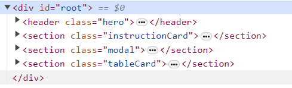
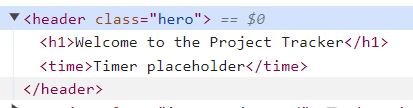

# Project-Tracker

Simple jQuery and Bootstrap project.

# About

This project was built for the University of Birmingham and 2U/Trilogy Coding Bootcamp, as a classroom mini-project, from scratch to a given [brief](./docs/BRIEF.md). It was built for week 4 of the course: which focused on jQuery and Bootstrap.

# Features

## 1A. jQuery: DOM Manipulation to Render HTML

The core objective of this project was to learn and practice jQuery, so all HTML elements are rendered through jQuery methods. Examples of jQuery methods I used to manipulate the DOM and render HTML include:

- Used the jQuery `$("#")` syntax to fetch from the HTML, by id.
   <details>
   <summary>See example</summary>
   <br>
   The script below uses jQuery syntax to fetch the element with the "root" id; this finds the element assigned the "root" id in index.html.

  ```javascript
  // Select the root div from the HTML.
  const rootEl = $("#root");
  ```

  <sub>from [.assets/script.js](.assets/script.js): line 1-2.</sub>

  ```html
  <div id="root"></div>
  ```

  <sub>from [index.html](index.html): line 12. </sub>
  <br>

   </details>

- Used the `.append()` method to render elements within that root element
   <details>
   <summary>See example</summary>
   The following script creates four new HTML elements, for the hero, card, modal and table elements respectively - then uses the '.append()' method to render the four new elements to the HTML.

  ```javascript
  // Render the four core sections of the page.
  const heroEl = $("<header>");
  const cardEl = $("<section>");
  const modalEl = $("<section>");
  const tableEl = $("<section>");
  rootEl.append(heroEl, cardEl, modalEl, tableEl);
  ```

  <sub>from [.assets/script.js](.assets/script.js): line 4-9.</sub>

  These elements are rendered to the HTML tree: this can be seen by inspecting the page using Chrome Developer Tools.

  
  
   <sub>see [live deployment](https://djbowen95.github.io/Project-Tracker/)</sub>.
  </details>

- Used the `.text()` method to add text content to rendered HTML elements
   <details>
   <summary>See example</summary>
   The script here creates a new HTML element called 'welcomeEl', which is the header text for the hero element, and then uses the '.text()' method to assign the inner text value. 

   ```javascript
   // Hero section: render welcome text and display current date.
   const welcomeEl = $("<h1>");
   ...
   welcomeEl.text("Welcome to the Project Tracker");
   ```
   <sub>from [.assets/script.js](.assets/script.js): line 11-19.</sub>

   This is can be seen displayed at the head of 'index.html'. 

   
   <sub>see [live deployment](https://djbowen95.github.io/Project-Tracker/)</sub>.

   </details>
- Used the `.attr()` method to assign properties, such as classes, to rendered HTML elements
   <details>
   <summary>See example</summary>
   This script runs the '.attr' method on the heroEl object, using it to assign the element the 'hero' class.

   ```javascript
   heroEl.attr("class", "hero");
   ```
   <sub>from [.assets/script.js](.assets/script.js): line 15.</sub>

   This can be seen by inspecting the element using Chrome Developer Tools: 

   
   <sub>see [live deployment](https://djbowen95.github.io/Project-Tracker/)</sub>.

   </details>

## 1B. jQuery: Event Handling, for Click Events

All event handling was done through jQuery methods. The examples below are for the first event handling function I built for the project: a click event for a button that controlled conditional rendering on the form element. When clicked, it would hide or display the form. To do this, I:

- Used the jQuery `.on()` method to create an event handling callback function
   <details><summary>See example </summary>
   
   The `.on()` method takes a callback function as one of its parameters. Here I have used it to build a function which checks the value of the `isFormDisplayed` variable (a boolean value). It will render the `modalEl` object differently depending on this value; it then sets the value of the variable to the opposite boolean value, for next time the button is clicked.  
   
   ```javascript
   let isFormDisplayed = false;
   newProjectButton.on("click", () => {
    if (isFormDisplayed) {
        modalEl.css("display", "none");
    } else {
        modalEl.css("display", "block");
    }
    isFormDisplayed = !isFormDisplayed;
   });
   ```
   <sub>from [.assets/script.js](.assets/script.js): line 33-41.</sub>

   This click event can be tested at the [current live deployment](https://djbowen95.github.io/Project-Tracker/). I will make a gif to demonstrate this at a later point.

   </details>
- Used the `.css()` method to change the css `display` property for the element I wanted to change.
   <details>
   <summary>See example </summary>
   The jQuery '.css()' method is used in these two lines from the previously given example to change whether or not the modal element, or 'modalEl', is visible: the method changes the value of the display property. 

   ```javascript
        modalEl.css("display", "none");
   ...
        modalEl.css("display", "block");
   ```
   <sub>from [.assets/script.js](.assets/script.js): line 36-38.</sub>

   In CSS, the `display: none` property renders an item hidden; `display: block` is the default and will show the item on a new line, and visible.
   </details>
